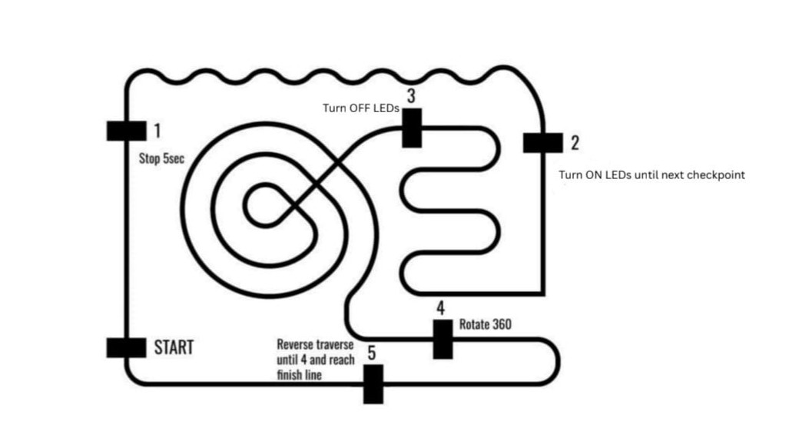

# Line Follower Robot - Checkpoint Navigation

An autonomous line follower robot with checkpoint-based navigation system, implementing PID control and sequential task execution. Built for the Line Follower Competition at Model Engineering College, Kochi, where it secured first prize.

---

## Background

### Evolution from Previous Design
This design builds upon lessons learned from a previous competition at Government Engineering College, Thrissur. The earlier implementation faced challenges:
- Physical constraints (near 20 cm size limit) affecting turn radius
- Suboptimal PID tuning for variable track conditions
- Software logic that needed improvement

Key improvements in this version:
- **Mechanical**: Reduced overall length for tighter turn radius
- **Software**: Complete control logic redesign
- **PID Implementation**: Retuned from scratch with better damping characteristics
- **State Management**: Cleaner state machine architecture

These changes resulted in improved stability, smoother trajectories, and more reliable checkpoint detection.

**Previous Version**: [Line Following Robot PID (GEC Thrissur)](https://github.com/Deratheone/line_follwing_robot_PID)

---

## Team

Alfin, Devanarayanan, Hithek, Deeraj

---

## 📋 Competition Tasks

The competition featured a checkpoint-based navigation system where the robot had to perform specific actions at designated points on the track. Checkpoints were marked as black boxes that triggered all sensors simultaneously.

### Track Layout and Task Details


*Competition track layout showing the path and checkpoint task details*

### Checkpoint Sequence

1. **Start Box** - Move straight through
2. **Checkpoint 2** - Stop for 5 seconds
3. **Checkpoint 3** - Turn on Green LED (continues until checkpoint 4)
4. **Checkpoint 4** - Turn off Green LED
5. **Junction (False Trigger)** - Take left turn (skipping the optional loop)
6. **Checkpoint 6** - Perform 360° rotation and continue
7. **Checkpoint 7** - Reverse traverse until next checkpoint detected
8. **Checkpoint 8** - Reverse traverse, ignore next checkpoint, stop at subsequent checkpoint
9. **Final Checkpoint** - Stop and blink Red LED 5 times

**Note**: The map included an optional loop section at the junction. We chose to skip it by taking the left turn, optimizing for speed and reliability.

**Reverse Traverse**: Rotate 180° until line is detected, then follow the line in reverse direction.

---

## 🔧 Hardware Components

### Microcontroller
- **Arduino Nano**

### Motor Driver
- **TB6612FNG Dual Motor Driver**

### Sensors
- **QTR-8A IR Sensor Array** (8 sensors)

### Power
- **Buck Converter** (for sensor array)
- **Battery Pack** (motor power)

### Other Components
- Push Button (start trigger)
- RGB LED (status indicators)
- DC Motors with wheels

---

## 📡 Hardware Connections

### Motor Driver (TB6612FNG)
| Pin | Arduino Pin |
|-----|-------------|
| AIN1 | D7 |
| AIN2 | D8 |
| PWMA | D5 |
| BIN1 | D9 |
| BIN2 | D11 |
| PWMB | D6 |
| STBY | VCC (hard-wired) |
| VCC/GND | Battery |

### QTR Sensor Array
| Component | Connection |
|-----------|------------|
| GND/VCC | Buck Converter |
| IR ON | VCC (hard-wired) |
| Sensor 1 | A6 |
| Sensor 2 | A0 |
| Sensor 3 | A1 |
| Sensor 4 | A2 |
| Sensor 5 | A3 |
| Sensor 6 | A4 |
| Sensor 7 | A5 |
| Sensor 8 | A7 |

### Control & Indicators
| Component | Arduino Pin |
|-----------|-------------|
| Push Button | D13 |
| Blue LED | D2 |
| Red LED | D12 |
| Green LED | D4 |

---

## 💻 Software Features

### PID Control System
- **Proportional (Kp)**: 0.319
- **Integral (Ki)**: 0.0
- **Derivative (Kd)**: 2.9

Carefully tuned PID constants ensure smooth line following with minimal oscillation.

### Advanced Features
- **Automatic Calibration**: 5-second sensor calibration routine
- **Checkpoint Detection**: Duration-based detection (80ms) with cooldown (2.5s)
- **Tight Turn Detection**: Adaptive behavior for sharp corners (4+ active sensors)
- **Line Lost Recovery**: Intelligent search based on last known position
- **Adaptive Speed**: Reduced speed on sharp turns for stability
- **State Machine**: Clean state management (IDLE, CALIBRATING, READY, LINE_FOLLOWING, CHECKPOINT_ACTION)

### Motor Trim System
Fine-tune individual motor speeds for perfectly straight movement:
```cpp
int leftMotorTrim = 0;   // Adjust if robot veers right
int rightMotorTrim = 0;  // Adjust if robot veers left
```

---

## 🚀 Getting Started

### Prerequisites
- Arduino IDE (1.8.x or later)
- Arduino Nano board support
- USB cable for programming

### Installation

1. **Clone this repository**
   ```bash
   git clone https://github.com/yourusername/linefollower-checkpoint-navigation.git
   cd linefollower-checkpoint-navigation
   ```

2. **Open the code**
   ```bash
   linefollower.ino
   ```

3. **Connect Arduino Nano** to your computer via USB

4. **Upload the code**
   - Select **Tools > Board > Arduino Nano**
   - Select **Tools > Processor > ATmega328P** (or ATmega328P Old Bootloader)
   - Select the correct **Port**
   - Click **Upload**

### Usage

1. **Initial Calibration**
   - Place robot on the track
   - Press the button once
   - Red LED blinks twice - calibration starting
   - Move the robot slowly across the line for 5 seconds (or let it calibrate in place)
   - Green LED blinks twice - calibration complete

2. **Start the Run**
   - Position robot at the start checkpoint
   - Press the button again
   - Robot begins autonomous navigation

### LED Indicators
| LED | Meaning |
|-----|---------|
| Red blinks (2x) | Calibration starting |
| Green blinks (2x) | Calibration complete / Ready |
| Green solid | Active between checkpoints 3-4 |
| Red blinks (5x) | Run complete (final checkpoint) |

---

## ⚙️ Tuning Guide

### If Robot Drifts During Straight Movement
Adjust motor trim values:
```cpp
int leftMotorTrim = 5;   // If veering right, increase left motor
int rightMotorTrim = -5; // If veering left, increase right motor
```

### If PID Needs Adjustment
Current values work well for most tracks, but you can fine-tune:
- **Kp** (0.319): Increase for faster response, decrease for stability
- **Ki** (0.0): Usually kept at 0; add small value (0.001) for steady-state error
- **Kd** (2.9): Increase for sharp turn damping, decrease if too sluggish

### If Checkpoints Miss Detection
Adjust these constants:
```cpp
const unsigned long CHECKPOINT_DURATION = 80;    // Increase if missing checkpoints
const unsigned long CHECKPOINT_COOLDOWN = 2500;  // Decrease if too slow
```

---

## 📂 Repository Structure

```
linefollowerv2/
├── linefollower.ino       # Main Arduino code
├── README.md              # This file
└── images/                # Competition images and track photos
    └── path.jpeg
```

---


## 📝 Technical Highlights

### Checkpoint Detection Algorithm
Uses duration-based detection (80ms of all-black sensors) with cooldown periods to prevent false triggers from regular line junctions.

### Reverse Traverse Implementation
Executes 180° rotation until line is detected, then continues following the line in the opposite direction - essential for checkpoints 7 and 8.

### Junction Handling
Intelligently differentiates between actual checkpoints and line junctions (checkpoint 5) using contextual task sequencing.

### Tight Turn Detection
When 4+ sensors are active and position indicates sharp turn, switches from PID to direct differential steering for better corner handling.

---

## 📊 Performance Characteristics

- **Base Speed**: 120 PWM
- **Max Speed**: 150 PWM
- **Calibration Time**: 5 seconds
- **Checkpoint Detection**: 80ms duration threshold
- **Line Lost Timeout**: 100ms before recovery behavior
- **Turn Detection**: 4+ active sensors on extreme position

---

## Version History

- **v2.0** (2026) - MEC Kochi Implementation
  - Complete software rewrite with state machine architecture
  - Refined PID constants (Kp: 0.319, Kd: 2.9)
  - Duration-based checkpoint detection (80ms threshold)
  - Reduced mechanical footprint for improved turn performance
  - Adaptive speed control for sharp corners

- **v1.0** (2025) - GEC Thrissur Implementation
  - Initial design and implementation
  - [Previous Repository](https://github.com/Deratheone/line_follwing_robot_PID)


